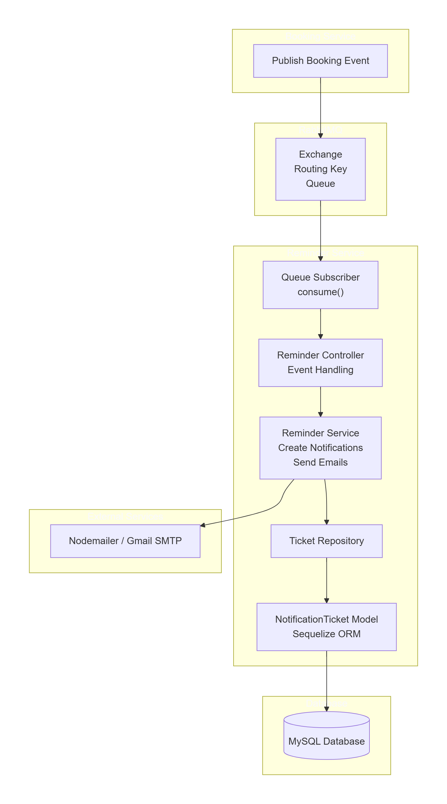

# Reminder Service 

`This is a email based reminder service`

A simple reminder backend built with Node.js to schedule and send email notifications.

## Project Overview

This project provides:
- A notification ticket model for reminders
- A REST API to create and manage reminders
- Email delivery support through a dedicated email service
- Background job scheduling for reminder notifications

## Reminder Service Diagram


## Installation

1. Install dependencies:
   ```bash
   npm install
   ```

## Running the Server

- to run server => `npm start`

## Key Files and Structure

- `src/index.js` - application entry point
- `src/config/` - service and email configuration
- `src/controllers/ticket-controller.js` - API controller logic
- `src/models/` - Sequelize models and index
- `src/repository/ticket-repository.js` - data access layer
- `src/routes/` - API routing setup
- `src/services/email-service.js` - email notification implementation
- `src/utils/job.js` - reminder job utilities
- `src/utils/messageQueue.js` - queue handling utilities

## Notes

Use the existing configuration files in `src/config/` to customize server settings and email transport.
